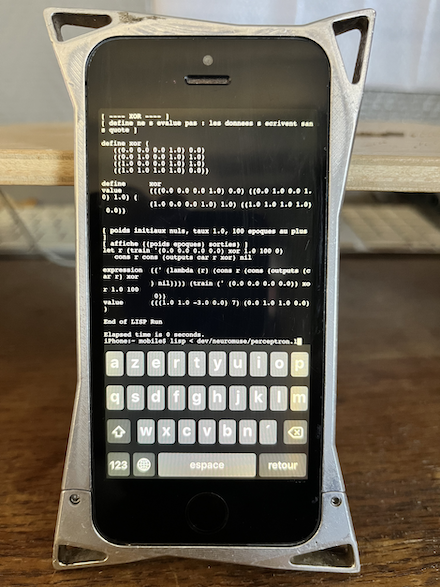

# neuromuse-ios — neuromuse sur iOS (expérimental)

<div align="center">
  
</div>

Experimentation d'idées développées dans [neuromuse](https://github.com/FredVoisin/neuromuse)
avec un Lisp maison natif sur iPhone 5s.

L'interpréteur est fondé sur le **`lisp.c` de Gregory J. Chaitin**, non inclu ici.
Ce dépôt contient seulement les modifications de l'interpréteur et les exemples:

- `chaitin-lisp/neuromuse.patch` — avec `load` et nombres décimaux
  (`/ exp log sqrt floor float random seed`) nécessaires ajoutées à `lisp.c`
- `chaitin-lisp/Makefile` — applique le patch et compile avec le SDK Theos
- `examples/*.l` — exemple dans le dialecte Lisp de Chaitin (`.l`, not Common Lisp)

## Build

```sh
cd chaitin-lisp
cp /path/to/chaitin/lisp.c lisp.orig.c
make
```

## Run

```sh
cd examples
../chaitin-lisp/lisp
load float-test.l
```

## Documentation

- [doc/chaitin-lisp.md](doc/chaitin-lisp.md) — build, problems solved, extensions, pitfalls
- [doc/lisp-code.md](doc/lisp-code.md) — Lisp code and results

## Status

- [x] `load` and floating-point extension (tested on iPhone 5s)
- [x] perceptron (`examples/perceptron.l`, port in progress)
- [ ] SOM (`examples/som.l`, draft, tested on Linux only)
- [ ] perceptron → WAV playback

## License

[PolyForm Noncommercial License 1.0.0](LICENSE). This does not cover
Chaitin's `lisp.c`, which is not included.

---

**Frédéric Voisin** — Composer, sound artist, ethnomusicologist  
[fredvoisin.com](https://fredvoisin.com)
